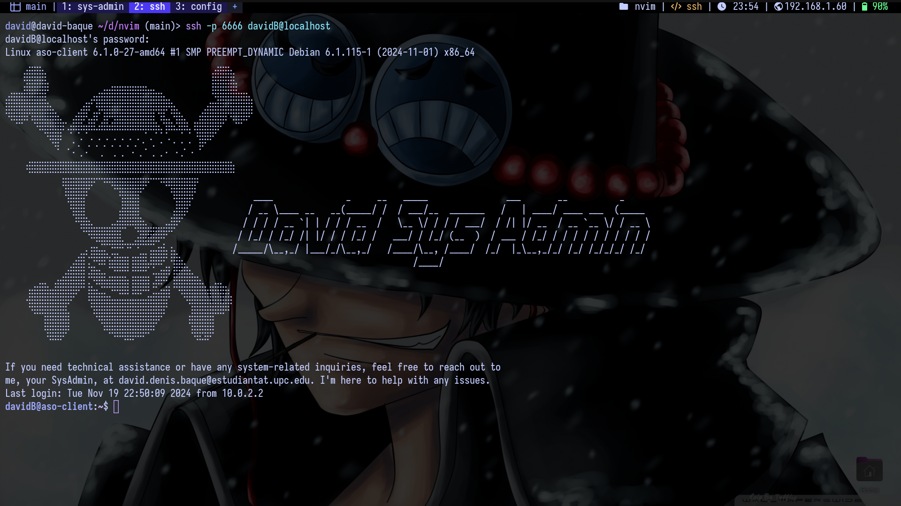

# My Dotfiles Configuration



This repository contains my personal configuration for **Neovim**, **WezTerm**, and **Fish Shell**. It allows you to replicate my setup on your own machine quickly and efficiently.

## Getting Started

To use this configuration, simply clone the repository and run the setup script. This script, `dotfiles.sh`, will synchronize the configurations in this repository with your system.

### Prerequisites

Make sure you have the following applications installed on your system:
- **Neovim**
- **WezTerm**
- **Fish Shell**

The script will not install these applications; it only syncs the configuration files.

### Installation

To set up these configurations on your machine, follow these steps:

1. **Clone the repository**:

``` bash
git clone https://github.com/ddbaque/dotfiles.git
cd dotfiles
```

2. **Run the setup script**:

``` bash
chmod +x dotfiles.sh
./dotfiles.sh
```

This script will place the configuration files in the appropriate directories, syncing them with your system.

### Details of Configuration

- **Neovim**: Custom settings for an enhanced coding experience.
- **WezTerm**: Terminal customization to streamline workflows.
- **Fish Shell**: Shell configuration for improved usability and aesthetics.

### Usage

After running the setup script, you should be able to use **Neovim**, **WezTerm**, and **Fish Shell** with my configurations applied. Any further customization can be done directly within the respective configuration files.

### Troubleshooting

If you encounter issues or have feedback, please feel free to open an issue in this repository.


